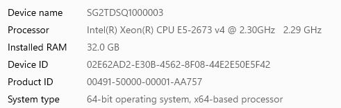
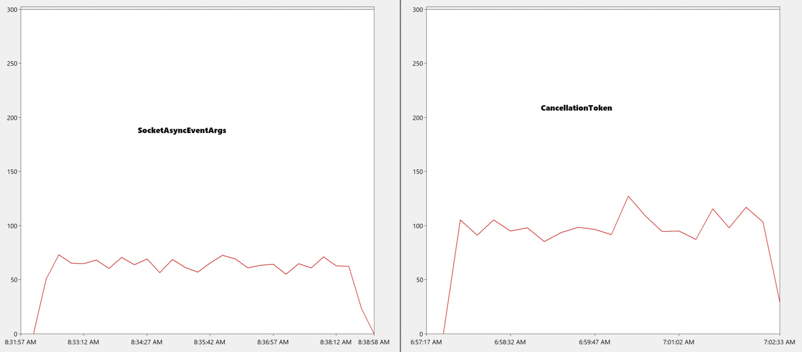

## Running the test
Just do dotnet-run in the Server and Client projects, ideally on 2 separate machines.  
For the server, change the `ECHOSERVER_USE_SAEA` env var to `1` or `0` to enable/disable `SocketAsyncEventArgs`.

## My results
I tested on 2 Azure VMs with the following specs:

Maximum request rate (per second) for `CancellationToken` version is ~50,000, for `SocketAsyncEventArgs` is ~75,000.

I also fixed the request rate to 30,000 requests-per-second and measured the CPU utilization:

